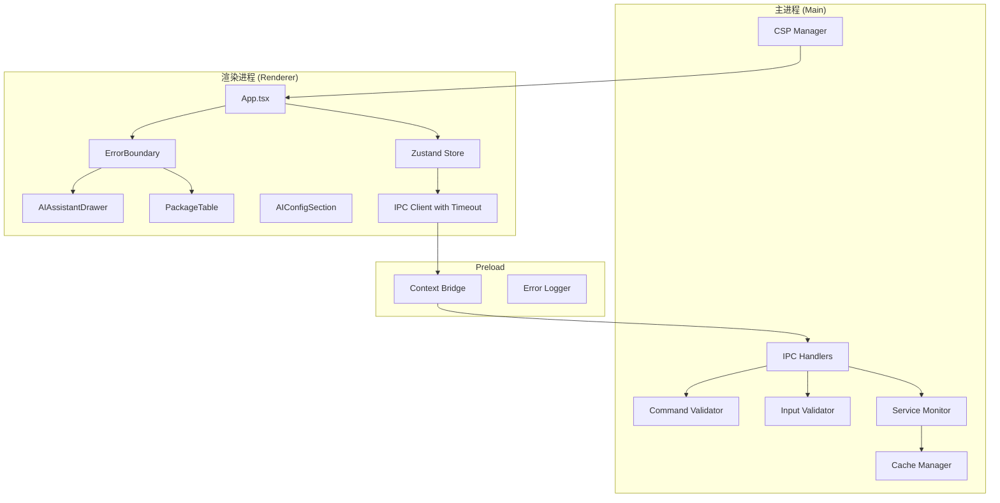
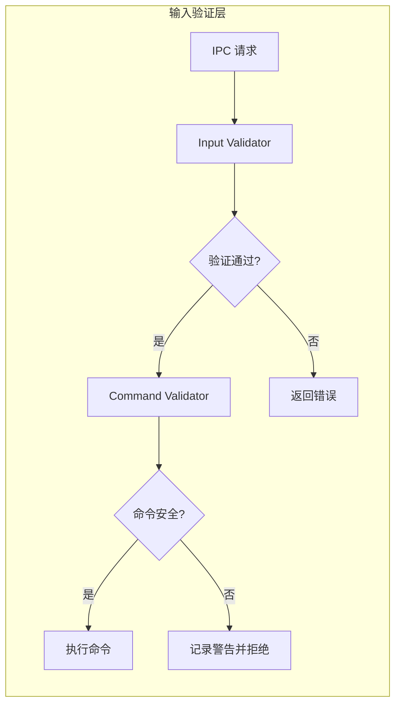

# 设计文档

## 概述

本设计文档描述了 Dev-Janitor Electron 应用程序代码健康修复的技术实现方案。修复工作分为六个主要领域：安全加固、内存管理、性能优化、UI/UX 改进、Electron 特定修复和代码质量提升。

**技术栈版本 (2026年1月)**:
- Electron: 40.x (当前稳定版，基于 Chromium M144, Node.js v24.11.1)
- TypeScript: 5.9+ (考虑 TypeScript 7.0 即将发布的 Go 重写版本)
- React: 18.x / 19.x
- fast-check: 3.x (属性测试库)
- Vitest: 最新稳定版

设计遵循以下原则：
- **最小侵入性**: 尽量在现有架构上进行修复，避免大规模重构
- **向后兼容**: 确保修复不会破坏现有功能
- **可测试性**: 所有修复都应该可以通过自动化测试验证
- **渐进式实施**: 按优先级分阶段实施，关键安全问题优先
- **遵循 Electron 安全最佳实践**: 参考 Electron 官方 2025/2026 安全指南

## 架构

### 整体架构图



### 安全层架构



## 组件和接口

### 1. Command Validator (命令验证器)

**文件位置**: `src/main/security/commandValidator.ts`

**Electron 安全最佳实践 (2025/2026)**:
根据 Electron 官方安全指南第 15 条 "Do not use shell.openExternal with untrusted content"，
以及第 17 条 "Validate the sender of all IPC messages"，命令执行必须严格验证。

```typescript
interface CommandValidationResult {
  valid: boolean;
  sanitizedCommand?: string;
  error?: string;
}

interface CommandValidator {
  // 验证命令是否在白名单中
  validateCommand(command: string): CommandValidationResult;
  
  // 检查危险字符
  containsDangerousChars(input: string): boolean;
  
  // 转义参数
  escapeArgument(arg: string): string;
  
  // 获取允许的命令列表
  getAllowedCommands(): string[];
}

// 允许的命令白名单 (仅限开发工具相关命令)
const ALLOWED_COMMANDS = [
  'npm',
  'npx',
  'pip',
  'pip3',
  'composer',
  'cargo',
  'gem',
  'node',
  'python',
  'python3',
];

// 危险字符模式 - 防止命令注入
const DANGEROUS_PATTERNS = /[;&|`$(){}[\]<>\\'"]/;

// 验证 IPC 消息发送者 (Electron 安全指南第 17 条)
function validateIPCSender(event: Electron.IpcMainInvokeEvent): boolean {
  // 确保消息来自预期的渲染进程
  const webContents = event.sender;
  const url = webContents.getURL();
  // 验证 URL 是否来自应用本身
  return url.startsWith('file://') || url.startsWith('http://localhost');
}
```
```

### 2. Input Validator (输入验证器)

**文件位置**: `src/main/security/inputValidator.ts`

```typescript
interface ValidationResult<T> {
  valid: boolean;
  value?: T;
  error?: string;
}

interface InputValidator {
  // 验证包名
  validatePackageName(name: string): ValidationResult<string>;
  
  // 验证 PID
  validatePID(pid: unknown): ValidationResult<number>;
  
  // 验证路径
  validatePath(path: string): ValidationResult<string>;
  
  // 验证包管理器类型
  validatePackageManager(manager: string): ValidationResult<'npm' | 'pip' | 'composer'>;
}

// 包名正则表达式
const NPM_PACKAGE_PATTERN = /^(@[a-z0-9-~][a-z0-9-._~]*\/)?[a-z0-9-~][a-z0-9-._~]*$/;
const PIP_PACKAGE_PATTERN = /^[a-zA-Z0-9]([a-zA-Z0-9._-]*[a-zA-Z0-9])?$/;

// 路径遍历检测
const PATH_TRAVERSAL_PATTERN = /\.\./;
```

### 3. CSP Manager (内容安全策略管理器)

**文件位置**: `src/main/security/cspManager.ts`

**2025/2026 最佳实践**: 根据 Electron 官方安全指南和 MDN CSP 文档，现代 CSP 实现应使用 "Strict CSP" 策略，优先使用 nonce 或 hash 而非域名白名单。

```typescript
interface CSPConfig {
  isDevelopment: boolean;
  devServerUrl?: string;
  nonce?: string; // 用于动态脚本的 nonce
}

interface CSPManager {
  // 生成 CSP 头
  generateCSPHeader(config: CSPConfig): string;
  
  // 应用 CSP 到窗口
  applyToWindow(window: BrowserWindow, config: CSPConfig): void;
  
  // 生成随机 nonce
  generateNonce(): string;
}

// CSP 策略模板 (Strict CSP - 2025/2026 推荐)
// 参考: https://www.electronjs.org/docs/latest/tutorial/security#7-define-a-content-security-policy
const CSP_POLICY = {
  'default-src': ["'self'"],
  'script-src': ["'self'"], // 不使用 'unsafe-inline'，使用 nonce 代替
  'style-src': ["'self'", "'unsafe-inline'"], // Ant Design 需要内联样式
  'img-src': ["'self'", 'data:', 'https:'],
  'connect-src': ["'self'"], // 开发模式会添加 localhost
  'font-src': ["'self'"],
  'object-src': ["'none'"], // 禁止插件
  'base-uri': ["'self'"],
  'form-action': ["'self'"],
  'frame-ancestors': ["'none'"], // 防止点击劫持
};

// 使用 webRequest.onHeadersReceived 设置 CSP (推荐方式)
// 或使用 <meta> 标签 (file:// 协议时的备选方案)
```

### 4. Cache Manager (缓存管理器)

**文件位置**: `src/main/utils/cacheManager.ts`

**2025/2026 最佳实践**: LRU 缓存实现使用 Map + 双向链表组合，提供 O(1) 的 get/set 操作。现代 JavaScript 的 Map 保持插入顺序，可以简化实现。

```typescript
interface CacheEntry<T> {
  value: T;
  timestamp: number;
}

interface LRUCache<K, V> {
  get(key: K): V | undefined;
  set(key: K, value: V): void;
  delete(key: K): boolean;
  clear(): void;
  size: number;
  cleanup(): void;
}

/**
 * 有界 LRU 缓存实现
 * 使用 Map 的插入顺序特性实现 LRU
 * 参考: https://www.geeksforgeeks.org/javascript/lru-cache-using-javascript/
 */
class BoundedLRUCache<K, V> implements LRUCache<K, V> {
  private cache: Map<K, CacheEntry<V>>;
  private maxSize: number;
  private maxAge: number;
  
  constructor(maxSize: number = 1000, maxAge: number = 300000) {
    this.cache = new Map();
    this.maxSize = maxSize;
    this.maxAge = maxAge; // 5 分钟默认过期
  }
  
  get(key: K): V | undefined {
    const entry = this.cache.get(key);
    if (!entry) return undefined;
    
    // 检查是否过期
    if (Date.now() - entry.timestamp > this.maxAge) {
      this.cache.delete(key);
      return undefined;
    }
    
    // 移动到最近使用位置 (删除后重新插入)
    this.cache.delete(key);
    this.cache.set(key, entry);
    return entry.value;
  }
  
  set(key: K, value: V): void {
    // 如果已存在，先删除
    if (this.cache.has(key)) {
      this.cache.delete(key);
    }
    
    // 如果达到最大容量，删除最旧的条目
    if (this.cache.size >= this.maxSize) {
      const oldestKey = this.cache.keys().next().value;
      if (oldestKey !== undefined) {
        this.cache.delete(oldestKey);
      }
    }
    
    this.cache.set(key, { value, timestamp: Date.now() });
  }
  
  // 清理过期条目
  cleanup(): void {
    const now = Date.now();
    for (const [key, entry] of this.cache) {
      if (now - entry.timestamp > this.maxAge) {
        this.cache.delete(key);
      }
    }
  }
}
```

### 5. IPC Client with Timeout (带超时的 IPC 客户端)

**文件位置**: `src/renderer/ipc/ipcClientWithTimeout.ts`

```typescript
interface IPCCallOptions {
  timeout?: number;
  retries?: number;
}

interface IPCClientWithTimeout {
  invoke<T>(channel: string, ...args: unknown[]): Promise<T>;
  invokeWithOptions<T>(
    channel: string, 
    options: IPCCallOptions, 
    ...args: unknown[]
  ): Promise<T>;
}

const DEFAULT_TIMEOUT = 30000; // 30 秒
const DEFAULT_RETRIES = 0;

// 超时包装器
function withTimeout<T>(
  promise: Promise<T>, 
  ms: number, 
  channel: string
): Promise<T> {
  return Promise.race([
    promise,
    new Promise<never>((_, reject) => 
      setTimeout(() => reject(new Error(`IPC call to ${channel} timed out after ${ms}ms`)), ms)
    )
  ]);
}
```

### 6. Debounced Service Monitor (防抖服务监控)

**文件位置**: `src/main/serviceMonitor.ts` (修改现有文件)

```typescript
interface DebouncedServiceMonitor {
  // 启动监控（带防抖）
  startMonitoring(interval: number, debounceMs: number): void;
  
  // 设置窗口可见性
  setWindowVisible(visible: boolean): void;
  
  // 强制立即更新
  forceUpdate(): Promise<void>;
}

// 防抖配置
const DEBOUNCE_MS = 500;
const BACKGROUND_INTERVAL = 30000; // 窗口不可见时 30 秒
const FOREGROUND_INTERVAL = 5000;  // 窗口可见时 5 秒
```

### 7. Optimized PackageTable (优化的包表格)

**文件位置**: `src/renderer/components/Packages/PackageTable.tsx` (修改现有文件)

**2025/2026 React 性能最佳实践**: 
- useMemo 用于缓存计算结果，避免每次渲染重新计算
- useCallback 用于稳定函数引用，防止子组件不必要的重渲染
- 研究表明优化后可减少 30-50% 的渲染时间
- 参考: https://johnkavanagh.co.uk/articles/optimising-react-performance-with-usememo-and-usecallback/

```typescript
// 使用 useMemo 缓存版本比较结果
const memoizedVersionComparison = useMemo(() => {
  return packages.reduce((acc, pkg) => {
    const cached = versionCache[pkg.name];
    if (cached?.checked) {
      acc[pkg.name] = compareVersions(pkg.version, cached.latest);
    }
    return acc;
  }, {} as Record<string, number>);
}, [packages, versionCache]);

// 使用 useCallback 包装事件处理器，避免每次渲染创建新函数
const handleCheckVersion = useCallback(async (packageName: string) => {
  // 版本检查逻辑
}, [manager, setVersionCache]);

const handleUpdatePackage = useCallback(async (packageName: string) => {
  // 更新逻辑
}, [manager, onRefresh]);

const handleCopyLocation = useCallback((location: string) => {
  navigator.clipboard.writeText(location);
}, []);

// 版本检查进度状态
interface VersionCheckProgress {
  total: number;
  completed: number;
  cancelled: boolean;
  abortController?: AbortController; // 支持取消操作
}

// 使用 React.memo 包装行组件，配合 useMemo 的比较结果
const PackageRow = React.memo(({ pkg, comparison, onCheck, onUpdate }) => {
  // 行渲染逻辑
});
```

### 8. Error Boundary for Markdown (Markdown 错误边界)

**文件位置**: `src/renderer/components/AI/MarkdownErrorBoundary.tsx`

```typescript
interface MarkdownErrorBoundaryProps {
  children: React.ReactNode;
  fallback?: React.ReactNode;
  onError?: (error: Error, errorInfo: React.ErrorInfo) => void;
  onRetry?: () => void;
}

interface MarkdownErrorBoundaryState {
  hasError: boolean;
  error: Error | null;
}

class MarkdownErrorBoundary extends React.Component<
  MarkdownErrorBoundaryProps, 
  MarkdownErrorBoundaryState
> {
  static getDerivedStateFromError(error: Error): MarkdownErrorBoundaryState {
    return { hasError: true, error };
  }
  
  componentDidCatch(error: Error, errorInfo: React.ErrorInfo): void {
    console.error('Markdown rendering error:', error, errorInfo);
    this.props.onError?.(error, errorInfo);
  }
  
  handleRetry = (): void => {
    this.setState({ hasError: false, error: null });
    this.props.onRetry?.();
  };
}
```

### 9. Unified Error Response (统一错误响应)

**文件位置**: `src/shared/types/ipcResponse.ts`

```typescript
interface IPCResponse<T = unknown> {
  success: boolean;
  data?: T;
  error?: {
    code: string;
    message: string;
    details?: unknown;
  };
}

// 错误代码枚举
enum IPCErrorCode {
  VALIDATION_ERROR = 'VALIDATION_ERROR',
  COMMAND_REJECTED = 'COMMAND_REJECTED',
  TIMEOUT = 'TIMEOUT',
  NOT_FOUND = 'NOT_FOUND',
  PERMISSION_DENIED = 'PERMISSION_DENIED',
  INTERNAL_ERROR = 'INTERNAL_ERROR',
}

// 创建成功响应
function createSuccessResponse<T>(data: T): IPCResponse<T> {
  return { success: true, data };
}

// 创建错误响应
function createErrorResponse(
  code: IPCErrorCode, 
  message: string, 
  details?: unknown
): IPCResponse<never> {
  return { 
    success: false, 
    error: { code, message, details } 
  };
}
```

## 数据模型

### 安全验证结果

```typescript
interface SecurityValidationResult {
  valid: boolean;
  sanitizedValue?: string;
  violations: SecurityViolation[];
}

interface SecurityViolation {
  type: 'dangerous_char' | 'path_traversal' | 'invalid_format' | 'not_allowed';
  message: string;
  position?: number;
}
```

### 缓存条目

```typescript
interface ProcessCacheEntry {
  name: string;
  command: string;
  timestamp: number;
  accessCount: number;
}

interface CacheStats {
  size: number;
  maxSize: number;
  hitRate: number;
  evictionCount: number;
}
```

### 版本检查进度

```typescript
interface VersionCheckProgress {
  total: number;
  completed: number;
  failed: number;
  cancelled: boolean;
  currentPackage?: string;
}

interface VersionCheckResult {
  packageName: string;
  currentVersion: string;
  latestVersion: string | null;
  status: 'up-to-date' | 'outdated' | 'error';
  error?: string;
}
```

### IPC 调用状态

```typescript
interface IPCCallState {
  pending: boolean;
  error: string | null;
  retryCount: number;
  lastAttempt: number | null;
}

interface IPCCallMetrics {
  channel: string;
  duration: number;
  success: boolean;
  timestamp: number;
}
```


## 正确性属性

*正确性属性是系统在所有有效执行中应保持为真的特征或行为——本质上是关于系统应该做什么的形式化陈述。属性作为人类可读规范和机器可验证正确性保证之间的桥梁。*

### Property 1: 命令验证安全性

*对于任意* 命令字符串，如果命令不在白名单中或包含危险字符（`;`, `|`, `&`, `$`, `` ` ``, `(`, `)`, `{`, `}`, `[`, `]`, `<`, `>`, `\`），则 Command_Validator 应拒绝该命令并返回验证失败结果。

**Validates: Requirements 1.1, 1.2**

### Property 2: 参数转义完整性

*对于任意* 通过验证的命令参数，转义后的参数不应包含未转义的危险字符，且转义操作应是幂等的（多次转义结果相同）。

**Validates: Requirements 1.5**

### Property 3: 输入验证覆盖性

*对于任意* 输入值：
- 包名验证应仅接受符合 npm/pip 包名规范的字符串
- PID 验证应仅接受正整数
- 路径验证应拒绝包含 `..` 的路径

**Validates: Requirements 2.1, 2.2, 2.3**

### Property 4: CSP 脚本安全性

*对于任意* 生成的 CSP 策略字符串，`script-src` 指令不应包含 `'unsafe-inline'`（除非使用 nonce），以防止内联脚本执行。

**Validates: Requirements 3.2**

### Property 5: 事件监听器清理

*对于任意* AIAssistantDrawer 组件实例，在组件卸载后，不应存在任何与该实例相关的活跃事件监听器。重新挂载组件后，监听器数量应保持为 1。

**Validates: Requirements 4.1, 4.4**

### Property 6: 缓存边界约束

*对于任意* 缓存操作序列，processInfoCache 的大小永远不应超过 1000 条目。当缓存已满时添加新条目，应移除最近最少使用的条目。

**Validates: Requirements 5.1, 5.2**

### Property 7: 防抖合并行为

*对于任意* 在 500ms 时间窗口内触发的多次服务更新，Debouncer 应将它们合并为单次回调调用。

**Validates: Requirements 6.1**

### Property 8: 版本比较记忆化

*对于任意* 包列表和版本缓存状态，当包列表和版本缓存都未改变时，compareVersions 函数不应被重新调用。

**Validates: Requirements 7.1**

### Property 9: 选择性行重渲染

*对于任意* versionCache 更新，只有对应包名的表格行应重新渲染，其他行的渲染计数应保持不变。

**Validates: Requirements 7.3**

### Property 10: 虚拟滚动 DOM 边界

*对于任意* 包含超过 100 个包的列表，渲染的 DOM 节点数量应保持在一个固定上限内（如可视区域行数 + 缓冲区），而非与列表长度成正比。

**Validates: Requirements 7.4**

### Property 11: 进度显示准确性

*对于任意* 批量版本检查操作，进度指示器显示的已完成数量应等于实际已检查的包数量，总数量应等于待检查的包总数。

**Validates: Requirements 8.2**

### Property 12: 错误边界捕获

*对于任意* 在 Markdown 渲染过程中抛出的错误，Error_Boundary 应捕获该错误并显示降级 UI，而非导致整个组件树崩溃。

**Validates: Requirements 9.2**

### Property 13: IPC 处理器唯一性

*对于任意* 窗口创建/销毁序列，每个 IPC 通道应只有一个活跃的处理器。重复注册应被阻止或替换旧处理器。

**Validates: Requirements 11.4**

### Property 14: IPC 超时应用

*对于任意* 从渲染进程发起的 IPC 调用，应在 30 秒后超时并返回超时错误，而非无限等待。

**Validates: Requirements 13.1**

### Property 15: 配置加载降级

*对于任意* AI 配置加载失败场景，应用程序应继续使用默认配置运行，而非崩溃或进入不可用状态。

**Validates: Requirements 14.3**

### Property 16: 统一错误响应格式

*对于任意* IPC 处理器返回的响应，应符合 `{ success: boolean, data?: T, error?: { code: string, message: string } }` 格式。错误情况应返回错误对象而非抛出异常。空数组结果应与错误情况区分开。

**Validates: Requirements 15.1, 15.2, 15.4**

### Property 17: Store 空值安全

*对于任意* IPC 返回的 null 或 undefined 值，Store 应将其转换为适当的默认值（如空数组），而非直接存储 null/undefined。

**Validates: Requirements 16.1, 16.2**

## 错误处理

### 安全验证错误

| 错误场景 | 处理方式 | 用户反馈 |
|---------|---------|---------|
| 命令不在白名单 | 拒绝执行，记录警告 | 显示"命令不被允许"错误 |
| 检测到危险字符 | 拒绝执行，记录详情 | 显示"命令包含不安全字符"错误 |
| 包名格式无效 | 拒绝操作 | 显示"无效的包名格式"错误 |
| 路径遍历检测 | 拒绝操作 | 显示"路径包含不安全字符"错误 |

### 内存管理错误

| 错误场景 | 处理方式 | 用户反馈 |
|---------|---------|---------|
| 事件监听器清理失败 | 记录错误，强制清理 | 无（静默处理） |
| 缓存清理失败 | 记录错误，重置缓存 | 无（静默处理） |
| AbortController 错误 | 忽略 AbortError | 无（静默处理） |

### IPC 通信错误

| 错误场景 | 处理方式 | 用户反馈 |
|---------|---------|---------|
| IPC 调用超时 | 返回超时错误 | 显示"操作超时，请重试"消息 |
| IPC 处理器异常 | 捕获并返回错误响应 | 显示具体错误消息 |
| Preload 脚本失败 | 记录错误，提供降级 | 显示"部分功能不可用"警告 |

### UI 渲染错误

| 错误场景 | 处理方式 | 用户反馈 |
|---------|---------|---------|
| Markdown 渲染失败 | Error Boundary 捕获 | 显示"内容渲染失败"和重试按钮 |
| 组件渲染异常 | 全局 Error Boundary | 显示错误页面和刷新选项 |

## 测试策略

### 测试框架

- **单元测试**: Vitest (最新稳定版)
- **属性测试**: fast-check 3.x (TypeScript 属性测试库)
- **组件测试**: React Testing Library
- **E2E 测试**: Playwright (可选)

**2025/2026 测试最佳实践**:
- 属性测试 (Property-Based Testing) 已被证明能有效发现边界情况和隐藏 bug
- 参考 Anthropic 2026 年研究：使用属性测试在 NumPy、SciPy、Pandas 等顶级 Python 包中发现了多个 bug
- fast-check 是 TypeScript/JavaScript 生态中最成熟的属性测试库

### 单元测试覆盖

单元测试用于验证特定示例和边界情况：

1. **Command Validator**
   - 白名单命令通过验证
   - 非白名单命令被拒绝
   - 各种危险字符被检测
   - 参数转义正确性

2. **Input Validator**
   - 有效包名格式
   - 无效包名格式
   - 边界 PID 值（0, -1, MAX_INT）
   - 路径遍历模式

3. **Cache Manager**
   - 基本 get/set 操作
   - LRU 逐出顺序
   - 过期条目清理

4. **Error Boundary**
   - 错误捕获和显示
   - 重试功能
   - 错误日志记录

### 属性测试覆盖

属性测试用于验证普遍性质，每个测试至少运行 100 次迭代：

```typescript
import { describe, it, expect } from 'vitest';
import * as fc from 'fast-check';

// 示例：命令验证属性测试
describe('Command Validator Properties', () => {
  // Feature: code-health-fixes, Property 1: 命令验证安全性
  it('should reject all commands with dangerous characters', () => {
    fc.assert(
      fc.property(
        fc.string().filter(s => /[;&|`$(){}[\]<>\\]/.test(s)),
        (dangerousCommand) => {
          const result = commandValidator.validateCommand(dangerousCommand);
          return result.valid === false;
        }
      ),
      { numRuns: 100 }
    );
  });

  // Feature: code-health-fixes, Property 2: 参数转义完整性
  it('should produce idempotent escaping', () => {
    fc.assert(
      fc.property(fc.string(), (arg) => {
        const escaped1 = commandValidator.escapeArgument(arg);
        const escaped2 = commandValidator.escapeArgument(escaped1);
        return escaped1 === escaped2;
      }),
      { numRuns: 100 }
    );
  });
});

// 示例：缓存边界属性测试
describe('Cache Manager Properties', () => {
  // Feature: code-health-fixes, Property 6: 缓存边界约束
  it('should never exceed max size', () => {
    fc.assert(
      fc.property(
        fc.array(fc.tuple(fc.string(), fc.string()), { minLength: 0, maxLength: 2000 }),
        (entries) => {
          const cache = new BoundedLRUCache<string, string>(1000);
          for (const [key, value] of entries) {
            cache.set(key, value);
          }
          return cache.size <= 1000;
        }
      ),
      { numRuns: 100 }
    );
  });
});
```

### 测试标签格式

每个属性测试必须包含注释标签：

```typescript
// Feature: code-health-fixes, Property N: [属性标题]
```

### 集成测试

1. **IPC 通信流程**
   - 完整的请求-响应周期
   - 超时处理
   - 错误传播

2. **组件生命周期**
   - 挂载/卸载清理
   - 状态持久化

3. **跨进程安全**
   - 命令执行端到端
   - 参数验证端到端
